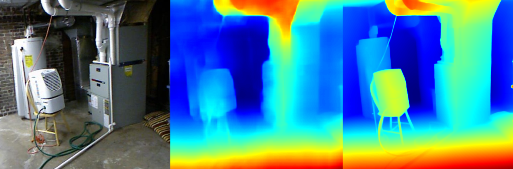

# ml-lde

Light Depth Estimation (LDE) pipeline using RGB images and “ground truth” depth maps generated by Apple’s Depth Pro  model using the NYU Depth V2 Dataset.  

> **Pipeline Example**  
>   
> Left: input RGB, Middle: predicted depth, Right: Depth Pro “ground truth”.  
> _Note: model trained on indoor scenes—performance will degrade on outdoor or markedly different environments._

## What this repo does

1. **Load paired RGB & depth** (Depth Pro `.npz`) and apply quadrant crops, jitter, flips, and normalize.  
   `src/data/dataset.py`  
2. **Encode** RGB via hybrid Vision Transformer + CNN (multiscale features).  
   `src/network/encoder.py`  
3. **Decode** depth features with FPN-style FusionBlock, GatedRefinementUnit, and upsampling head.  
   `src/network/decoder.py`  
4. **Compute loss** as weighted sum: 0.7 × L1 + 0.3 × (1 − SSIM).  
   `src/network/losses.py`  
5. **Assemble** LDE_Model combining encoder, decoder, and refinement.  
   `src/network/model.py`  
6. **Save/load checkpoints** for robust training resumption.  
   `src/checkpoint.py`  
7. **Train** on Dataset with mixed precision, cosine-warmup scheduler, logging, and checkpointing.  
   `src/train.py`  
8. **Offline visual test**: display RGB | predicted depth | ground truth panels.  
   `src/visual_test.py`  
9. **Webcam demo**: live depth estimation on webcam feed.  
   `src/webcam_demo.py`  

## Disclaimer

- Model trained exclusively on indoor scenes—may not generalize to outdoors or novel domains.  
- No explicit modeling of camera intrinsics, scale ambiguity, or metric depth calibration.

## License

MIT © 2025 **Robert Senatorov**

## Citation

```
@misc{lde-depth-pro,
  author = {Robert Senatorov},
  title  = {ml-lde: Light Depth Estimation with Depth Pro “ground truth”},
  year   = {2025},
  url    = {https://github.com/rsenatorov/ml-lde}
}
```  
